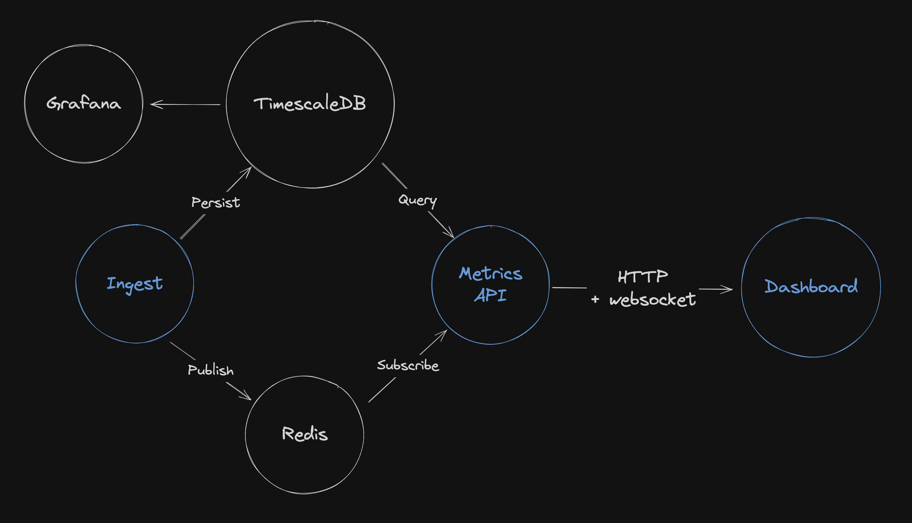

# Introduction

The task was to design and implement a full-stack application that processes real-time data and displays key metrics on a webpage for stakeholders.

# Assumptions

- **Stakeholders:**
    - Those that need real-time location data
    - Those that can tolerate batch updates
- **Data Types:**
    - **Summary Statistics (mean, min, max):** Likely don't need real-time updates as they smooth the data.
    - **Location Data:** Benefits from a real-time feed for monitoring live activity.
- **Use Cases:**
    - **Update on Interval:** The dashboard updates on a regular schedule with both summary statistics and the latest location data.
    - **Live Data:** The dashboard updates summary stats on an interval, but streams location data in real-time.
- **Data Storage:**
    - Metrics could be processed in memory, but storing in a time-series database is more reflective of real-world systems. This facilitates aggregations, historical analyses, and performance monitoring.

# System Architecture

The system has a few high-level requirements:

- Handle high-throughput data ingestion
- Provide real-time updates
- Offer historical insights

## **Workflow**

A combination of custom and industry-standard services coordinate to deliver a seamless experience. In particular, TimescaleDB, Redis, and Grafana are used to support the data ingestion service, the metrics API, and the web dashboard.

1. **Ingest Service:** Subscribes to the ZMQ publisher, processes data, stores it in TimescaleDB, and uses Redis for live data streaming.
2. **Metrics API:** Fetches calculated metrics from TimescaleDB and streams live data via Redis to the frontend.
3. **Dashboard:** Fetches data from the Metrics API and visualizes it using Leaflet, supporting both real-time and summary views.

## Components

### **Data Ingestion**

- **Ingest Service:** Subscribes to the ZMQ publisher, processes incoming data points, stores them in TimescaleDB, and redistributes live data using Redis Pub/Sub.

### **Data Storage**

- **TimescaleDB:** Stores incoming data points and handles summary statistics (mean, min, max, last lat/long/heading).
- **Redis:** Utilized for Pub/Sub to stream live data updates to the frontend, enabling efficient real-time data access.

### **Monitoring**

- **Grafana:** Provides real-time monitoring and historical analysis of data from TimescaleDB.

### **API Service**

- **Metrics API:** Exposes endpoints to fetch the calculated metrics from TimescaleDB and manages Redis subscriptions for streaming live data.

### Frontend Web App

- **Dashboard:** Built with SolidJS, fetches data from the Metrics API, and visualizes it using Leaflet. Supports both live and summary views.

# Design Choices

## Orchestration

- **Docker Compose**: Ensures all components are properly networked and configured for seamless integration.

## **Data Pipeline**

- **TimescaleDB:** A PostgreSQL extension ideal for time-series storage. It supports time-based indexing, retention policies, and continuous aggregations, facilitating efficient data management and query performance.
- **Redis:** Utilized for its pub/sub capabilities, controlling which messages are passed to the frontend and reducing unnecessary data transmission. This ensures the ingestion service is not overloaded.
- **Grafana**: Useful for monitoring the flow of data into TimescaleDB and alerting if metrics stop persisting or exceed expected thresholds.

## **Full-stack Application**

- **FastAPI:** A modern async API framework that is quick to set up and efficient.
- **SolidJS:** Similar to React, but with an easier mental model for reactivity.
- **Leaflet:** Free, open-source, and easy to use for creating interactive maps.

# Alternative Choices and Improvements

- **Kafka:** Could replace Redis for more robust streaming capabilities, especially if data rates significantly increase.
- **Configurable Refresh Interval:** Allow users to set the interval for long-polling.
- **Configurable Number of Records:** Support adjusting the number of top records displayed (currently only top 10).
- **Map Enhancements:** Improve map markers for better visualization.
- **Frontend Socket Management:**
    - Implement graceful reconnection.
    - Manage socket connections more efficiently, such as closing and reopening sockets when toggling live data view.
- **Enhanced Analytics:** Add more detailed analytics and historical data views in Grafana.
